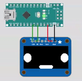

# BRZ / GT86 / FRS Flex Fuel

## Project

DIY flex fuel for BRZ / GT86 / FRS, which uses a 0.96 oled display screen.
I wanted to create my own flex fuel kit without paying over $500 dollars to just run E85. Also, I wanted to be able to show different animations / pictures on the oled screen for fun.

## Disclaimer & Background
This is a work in progress and has not been yet fully tested! I only wanted to try this for fun and I will be placing this into my BRZ. There are many forums out there that have done a DIY flex fuel kit.

## Demo
BRZ oLED display screen \

## Picture

## How does it work?
Using a fuel sensor, we can collect the fuel content and send this signal to the ecu via O2 sensor.

## Hardware

* Arduino Nano V3.0
* Fuel sensor 13577429 [Amazon] (https://www.amazon.com/gp/product/B01GQR9C5O/ref=ox_sc_saved_image_5?smid=ATVPDKIKX0DER&psc=1)
* Fuel Sensor Pigtail [Amazon] (https://www.amazon.com/gp/product/B07NWFW82Q/ref=ox_sc_saved_image_4?smid=A1ZMBG33NH7S0N&psc=1)
* Fuel lines 6an [Amazon] (https://www.amazon.com/gp/product/B091L54ZGT/ref=ox_sc_saved_image_3?smid=A2R9K3RS7G297P&th=1)
* Fuel male connect 6an to 3/8 [Amazon] (https://www.amazon.com/gp/cart/view.html?ref_=nav_cart)
* Fuel quick disconnect 6an to 3/8 [Amazon] (https://www.amazon.com/gp/cart/view.html?ref_=nav_cart)
* 0.96 oLED display

## Credits
Inspiration came from here:
https://www.ft86club.com/forums/showthread.php?t=94751

Amazing resource to create SSD1306 displays!:
https://rickkas7.github.io/DisplayGenerator/index.html

Inspiration for Face on screen:
https://www.thingiverse.com/thing:3506189

Core code for flex fuel sensor conversion from here:
https://forums.nasioc.com/forums/showthread.php?t=2810122

BRZ Startup car Logo: https://www.carthrottle.com/post/lrgyqx7/
